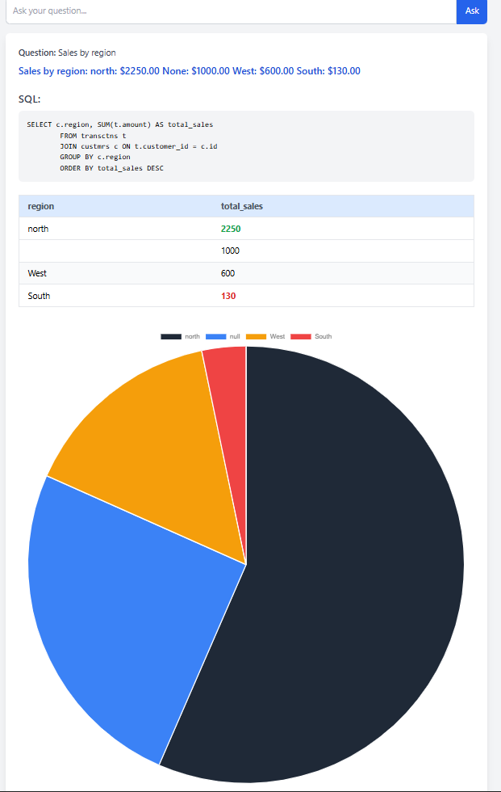
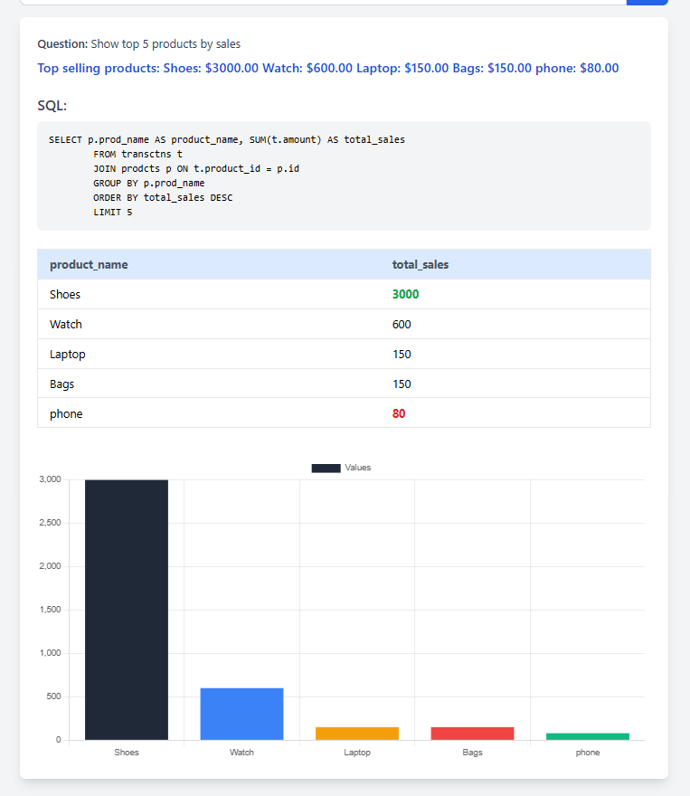

# AI Data Agent

**AI Data Agent** is a full-stack web application that allows users to ask complex business questions about sales, products, and customers. It translates natural language questions into SQL queries, retrieves data from the database, and presents answers with tables and interactive charts.




---

## Features

- Conversational interface to ask natural language questions.
- Supports analytical queries like:
    - Show top 5 products by sales
    - Total sales
    - Sales by region
    - Average price by category
    - Most expensive product
    - Cheapest product
    - Top customers

Sales by category
- Displays results in tables with highlighted max/min values.
- Generates interactive charts (bar and pie) for visual insights.
- Supports filters like region, category, and date range.
- Backend built with Python (FastAPI) and MySQL.
- Frontend built with React and Chart.js.
- Fully responsive and aesthetically designed with Tailwind CSS.

---

## Tech Stack

- **Frontend:** React, Tailwind CSS, Chart.js
- **Backend:** Python, FastAPI, MySQL
- **Database:** MySQL
- **Libraries:** Axios, Pydantic, difflib
- **Charts:** Bar & Pie charts using Chart.js

---


## Installation & Setup

### Backend

```bash
cd backend
```

```bash
python -m venv venv      # create virtual environment
```

```bash
./venv/Scripts/activate   
```

```bash
pip install -r requirements.txt
```

```bash
uvicorn main:app --reload
```

### Frontend

```bash
cd frontend
```

```bash
npm install
```

```bash
npm start
```


